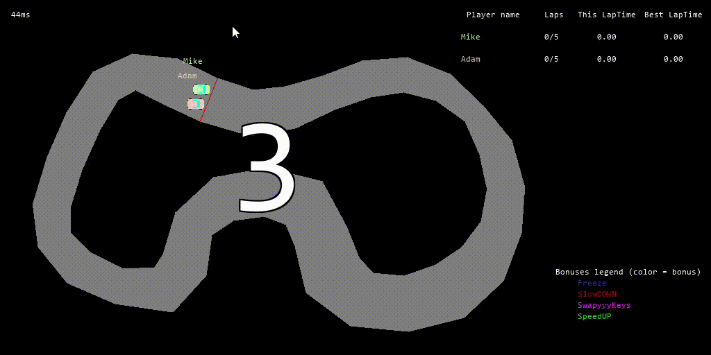
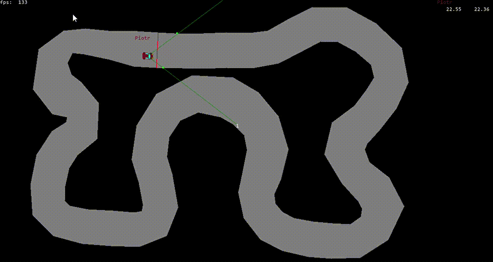

# About
It's car racing game created by me and 2 of my friends. To achieve that we used python and mainly library pyGame.\
Game includes:
- singleplayer mode
- multiplayer mode(server/client)
- AI riding (fuzzy logic)

## Multiplayer mode
Main goal of the game is to accomplish as fast as posiible 5 laps.
2 players, 4 bonuses randomly appearing on the track:
- **slowing down** (10 sec) *decrease a higher maximum speed*
- **speeding up** (10 sec) *increase a higher maximum speed*
- **freeze** (2 seconds) *stops the car*
- **swapping keys** (12 seconds) *left is right, right is left*
#### Example of a multiplayer game

## AI Player (Fuzzy logic)
***As input:***

- distance to the walls using rays (floating number between (0,1))

***As output:***

- acceleration (-1,1);
- turn (-1, 1) (left, right)

#### AI Player using 3 rays, parametrized manualy

#### AI Player using 2 rays, parametrized manualy

## Required libraries:

- pygame
- numpy
- opencv-python
- numba
- scipy

client for multiplayer:
python multiplayer.py

server:
python server.py

AI (fuzzy logic):
python fuzzy_main.py

singleplayer:
python singleplayer.py
